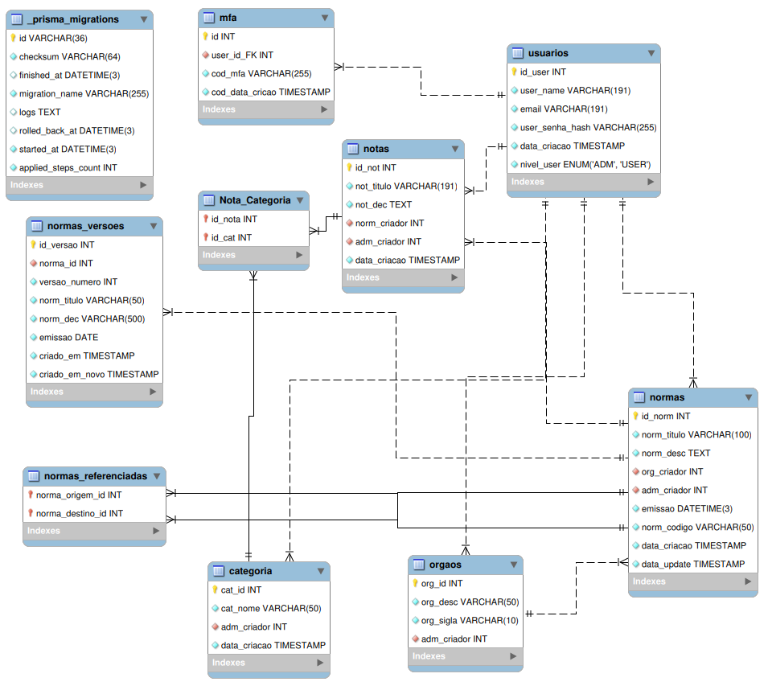

<div align="center">

## API 2º Semestre DSM - 2026

</div>

<div align="center">
  
### Projeto de Cadastro de Normas Técnicas Aeronáuticas - Akaer

</div>

<p align="center">
  
</p>

<h1 align="center">
<a href="https://developer.mozilla.org/en-US/docs/Web/HTML"></a>
  <a href="https://developer.mozilla.org/en-US/docs/Web/CSS"></a>
  <a href="https://react.dev/"></a>
  <a href="https://developer.mozilla.org/en-US/docs/Web/JavaScript"></a>
  <a href="https://www.typescriptlang.org/"></a>
  <a href="https://www.prisma.io/"></a>
  <a href="https://www.mysql.com/"></a>
  <a href="https://nodejs.org/"></a>
</h1>

<p align="center">
  <a href ="#Objetivo"> Objetivo</a>  |
  <a href ="#requisitos"> Requisitos do Cliente</a>  |  
  <a href ="#estrategia-branches"> Estratégia de Branches</a>  |
  <a href ="#tipos-commits"> Tipos de Commits</a>  |
  <a href ="#componentes"> Componentes</a>  |
  <a href ="#mvp"> MVP</a>  |
  <a href ="#cronogramaPJ"> Cronograma de Evolução do Projeto</a>  |
  <a href ="#escala-estimativa"> Escala de Estimativa de Esforço</a>  |
  <a href ="#product-backlog"> Product Backlog</a>  |
  <a href="docs/sprints/sprint1/readme.md">Sprint 1</a> |
  <a href="docs/sprints/sprint2/readme.md">Sprint 2</a> |
  <a href="docs/sprints/sprint3/readme.md">Sprint 3</a> |
  <a href ="#equipe"> Equipe</a>  |
  <a href ="#focalpoint"> Focal Point</a>
</p>

<br>

> Status do Projeto: FINALIZADO ✅

## :dart: Objetivo <a id="Objetivo"></a>
O desafio consiste em desenvolver uma plataforma web estruturada para centralizar, organizar e correlacionar requisitos normativos aeronáuticos. O sistema visa transformar o processo atual, que é manual e descentralizado, em uma fonte de dados organizada que reduza o tempo de análise e o risco de inconsistências interpretativas, apoiando a tomada de decisão de profissionais habilitados.

## :medal_sports: Requisitos do Cliente <a id="requisitos"></a>

AAKAER solicitou o desenvolvimento de uma solução capaz de fornecer uma base técnica sólida e rastreável para a Engenharia de Sistemas Aeronáuticos.

:black_small_square: Centralização de Dados: Realizar o cadastro de normas e seus requisitos vinculados.

:black_small_square: Organização Hierárquica: Estruturar e correlacionar os requisitos de forma lógica e hierárquica.

:black_small_square: Navegação Eficiente: Permitir consultas rápidas através de filtros por órgão, categoria e palavras-chave.

:black_small_square: Visualização Contextualizada: Apresentar, além do texto normativo, a interpretação técnica, abordagens aceitáveis e pontos de atenção.

:black_small_square: Interface e Acessibilidade: Garantir uma interface web responsiva com autenticação de usuários.

:black_small_square: Interoperabilidade: Estabelecer um conjunto de regras que permita a comunicação entre diferentes sistemas.

:black_small_square: Documentação Técnica: Entregar manuais de instalação e do usuário, além da documentação da API e modelagem do banco de dados.

# Estratégia de Branches <a id="estrategia-branches"></a>

| Regra | Descrição |
|:------|:----------|
| **main sempre estável** | Código pronto para produção |
| **feature/<id>-desc** | Padrão de nome para branches |
| **sem commit de código direto** | Nenhum código commitado direto na `main` |
| **PR obrigatório** | Toda mudança passa por Pull Request |
| **revisão obrigatória** | Mínimo 1 approval antes do merge |

## Tipos de Commits <a id="tipos-commits"></a>
| Tipo | Descrição |
|------|-----------|
| **feat** | Adição de um novo recurso ou funcionalidade |
| **fix** | Correção de um bug |
| **docs** | Atualização de documentação |
| **style** | Mudanças de formatação, sem afetar o código |
| **refactor** | Refatoração do código, sem alterar funcionalidade |
| **test** | Adiciona ou modifica testes |
| **chore** | Atualizações menores que não impactam diretamente a funcionalidade do código |

## Componentes <a id="componentes"></a>

### `<tipo>`
Identifica a natureza da mudança realizada no commit. Deve ser um dos tipos listados acima.

### `<id_demandaN>`
Identificador da demanda criada na ferramenta de gestão de Stories/Tasks que o Time estiver usando:
- GitHub Issues
- Jira Software
- GitLab Issues
- Outras ferramentas similares

Pode estar entre 1 e N, separados por vírgula quando houver múltiplos IDs.

### `<descrição da entrega feita no commit>`
Descrição clara sobre o que está sendo entregue no commit criado e enviado para o Git.

## Sprints<a id="mvp"></a>
  <details>
  <summary> MVP - Sprint 1 </summary>
  <br>

  ## 📋 Backlog da Sprint

| ID | Prioridade | User Story | Estimativa | Sprint | Status |
|:---|:---|:---|:---:|:---:|:---|
| $\color{green}{\text{1}}$ | $\color{green}{\text{Alta}}$ | $\color{green}{\text{Como Analista de Qualidade,}}$ $\color{green}{\text{quero cadastrar um novo}}$ $\color{green}{\text{projetista na plataforma}}$ $\color{green}{\text{(inserindo nome e e-mail),}}$ $\color{green}{\text{para garantir o acesso ao}}$ $\color{green}{\text{sistema e suas funcionalidades}}$ | $\color{green}{\text{11}}$ | $\color{green}{\text{1}}$ | $\color{green}{\text{✅}}$ |
| $\color{green}{\text{2}}$ | $\color{green}{\text{Alta}}$ | $\color{green}{\text{Como Analista de Qualidade,}}$ $\color{green}{\text{quero atribuir e manipular}}$ $\color{green}{\text{normas (emitente, título, data)}}$ $\color{green}{\text{técnicas ao sistema,}}$ $\color{green}{\text{para permitir melhor}}$ $\color{green}{\text{visualização das informações}}$ | $\color{green}{\text{11}}$ | $\color{green}{\text{1}}$ | $\color{green}{\text{✅}}$ |
| 3 | Alta | Como Analista de Qualidade, quero atribuir e manipular requisitos a uma norma, para que informações complementares fiquem registradas no sistema. | 13 | 1 | ✅ |
| $\color{green}{\text{4}}$ | $\color{green}{\text{Alta}}$ | $\color{green}{\text{Como Analista de Qualidade,}}$ $\color{green}{\text{quero realizar login}}$ $\color{green}{\text{informando meu email}}$ $\color{green}{\text{e senha para acessar}}$ $\color{green}{\text{o sistema.}}$ | $\color{green}{\text{8}}$ | $\color{green}{\text{1}}$ | $\color{green}{\text{✅}}$ |

<br>
  <video src="docs/videos/sprint1/video_mvp_api_2_sprint1.mp4" controls width="100%"></video>
  <br>
  <a href="https://youtu.be/Yi9m4oz6Bg4?si=PA6AvCtkteVwIgGQ" target="_blank">
    
  </a>

</details>

  <details>
  <summary> MVP - Sprint 2 </summary>
  <br>

  ## 📋 Backlog da Sprint

| ID | Prioridade | User Story | Estimativa | Sprint | Status |
|:---|:---|:---|:---:|:---:|:---|
| $\color{green}{\text{5}}$ | $\color{green}{\text{Alta}}$ | $\color{green}{\text{Como Analista de Qualidade,}}$ $\color{green}{\text{quero filtrar normas técnicas}}$ $\color{green}{\text{por órgão, categoria e palavra-chave,}}$ $\color{green}{\text{para agilizar o processo de busca.}}$ | $\color{green}{\text{8}}$ | $\color{green}{\text{2}}$ | $\color{green}{\text{🔛}}$ |
| 6 | Média | Como Analista de Qualidade, quero visualizar todos os projetistas cadastrados no site, para ter controle sobre a plataforma. | 8 | 2 | 🔛 |
| $\color{green}{\text{7}}$ | $\color{green}{\text{Média}}$ | $\color{green}{\text{Como Analista de Qualidade,}}$ $\color{green}{\text{quero adicionar notas técnicas}}$ $\color{green}{\text{a um requisito}}$ $\color{green}{\text{para documentar análises.}}$ | $\color{green}{\text{8}}$ | $\color{green}{\text{2}}$ | $\color{green}{\text{🔛}}$ |

<br>
  <video src="docs/videos/sprint2/video_mvp_api_2_sprint2.mp4" controls width="100%"></video>
  <br>
  <a href="https://youtu.be/OdWSUOaf51k?si=oA5Wvs_-lIdBVLXD" target="_blank">
    
  </a>

</details>

  <details>
  <summary> MVP - Sprint 3 </summary>

  ## 📋 Backlog da Sprint

| ID | Prioridade | User Story | Estimativa | Sprint | Status |
|:---|:---|:---|:---:|:---:|:---|
| $\color{green}{\text{8}}$ | $\color{green}{\text{Média}}$ | $\color{green}{\text{Como Analista de Qualidade, quero}}$ $\color{green}{\text{visualizar o histórico de alterações nos}}$ $\color{green}{\text{requisitos para rastreabilidade.}}$ | $\color{green}{\text{8}}$ | $\color{green}{\text{3}}$ | $\color{green}{\text{⏳}}$ |
| $\color{green}{\text{9}}$ | $\color{green}{\text{Baixa}}$ | $\color{green}{\text{Como Projetista, quero visualizar}}$ $\color{green}{\text{o site pelo meu celular, para}}$ $\color{green}{\text{visualizar detalhes técnicos.}}$ | $\color{green}{\text{8}}$ | $\color{green}{\text{3}}$ | $\color{green}{\text{⏳}}$ |

  <br>
  <video src="docs/videos/sprint3/video_mvp_api_2_sprint3.mp4" controls width="100%"></video>
  <br>
  <a href="https://youtu.be/RQWs5fracN8" target="_blank">
    
  </a>

</details>

| Sprint | Status | Documentação |
|:---:|:-----------|:------------------------|
| **Sprint 1** | Pronta |  [DOC](docs/sprints/sprint1/readme.md) |
| **Sprint 2** | Pronta |   [DOC](docs/sprints/sprint2/readme.md) |
| **Sprint 3** | Pronta |  [DOC](docs/sprints/sprint3/readme.md) |

<br>


## 🗃️ MODELO DE DADOS

<details>
<summary><b>Clique para visualizar o Modelo Conceitual do Banco de Dados</b></summary>
<br>



**Caminho:** `docs/model/CodewaveModel-Normas.png`

</details>

## 📆 Cronograma de Evolução do Projeto <a id="cronogramaPJ"></a>

| Sprint | Período |  Status  | Foco |
|:------:|:-------:|:------------:|:----------:|
| **Sprint 1**  | 16/03 - 05/04 | ✅ | Cadastro de usuários e normas |
| **Sprint 2**  | 13/04 - 03/05 | ✅ | Filtro de normas e requisitos |
| **Sprint 3**  | 11/05 - 31/05 | ✅ | Histórico de normas |

</br>

## 📊 Escala de Estimativa de Esforço <a id="escala-estimativa"></a>
 Pontuação | Significado | Estimativa | 
|:---:|:---|:---:|
| **1-5** | Muito Pequeno | Até 3 dias |
| **6-10** | Médio | Até 5 dias | 
| **11-15** | Grande | Até 10 dias | 
| **16-20** | Muito Grande | Até 15 dias|

## 📋 Product Backlog - User Stories <a id="product-backlog"></a>

| ID | Prioridade | User Story | Estimativa | Sprint | Status |
|:---:|:---:|:---|:---:|:---:|:---:|
| 1 | Alta | Como Analista de Qualidade, quero cadastrar um novo projetista na plataforma (inserindo nome e e-mail), para garantir o acesso ao sistema e suas funcionalidades. | 11 | 1 | ✅ |
| 2 | Alta | Como Analista de Qualidade, quero atribuir e manipular normas (emitente, título, data) técnicas ao sistema, para permitir melhor visualização das informações. | 11 | 1 | ✅ |
| 3 | Alta | Como Analista de Qualidade, quero atribuir e manipular requisitos a uma norma, para que informações complementares fiquem registradas no sistema. | 13 | 1 | ✅ |
| 4 | Alta | Como Analista de Qualidade, quero realizar login informando meu email e senha para acessar o sistema. | 8 | 1 | ✅ |
| 5 | Alta | Como Analista de Qualidade, quero filtrar normas técnicas por órgão, categoria e palavra-chave, para agilizar o processo de busca. | 8 | 2 | ✅ |
| 6 | Média | Como Analista de Qualidade, quero visualizar todos os projetistas cadastrados no site, para ter controle sobre a plataforma. | 8 | 2 | ✅ |
| 7 | Média | Como Analista de Qualidade, quero adicionar notas técnicas a um requisito para documentar análises. | 8 | 2 | ✅ |
| 8 | Média | Como Analista de Qualidade, quero visualizar o histórico de alterações nos requisitos para rastreabilidade. | 8 | 3 | ✅ |
| 9 | Baixa | Como Projetista, quero vizualizar o site pelo meu celular, para visualizar detalhes técnicos. | 8 | 3 | ✅ |

<br>

# File Tree: CodeWave-2DSM-API

```
├── 📁 api
│   ├── 📁 prisma
│   │   ├── 📁 migrations
│   │   │   ├── 📁 20260316201114_create_table_user
│   │   │   │   └── 📄 migration.sql
│   │   │   ├── 📁 20260316205051_create_table_orgaos
│   │   │   │   └── 📄 migration.sql
│   │   │   ├── 📁 20260316205903_create_table_categoria
│   │   │   │   └── 📄 migration.sql
│   │   │   ├── 📁 20260316224210_create_table_norma
│   │   │   │   └── 📄 migration.sql
│   │   │   ├── 📁 20260316224619_create_database_notas
│   │   │   │   └── 📄 migration.sql
│   │   │   ├── 📁 20260316225441_create_table_nota_categoria
│   │   │   │   └── 📄 migration.sql
│   │   │   ├── 📁 20260316230513_create_table_normas_referenciadas
│   │   │   │   └── 📄 migration.sql
│   │   │   ├── 📁 20260316235732_create_table_normas_versoes
│   │   │   │   └── 📄 migration.sql
│   │   │   ├── 📁 20260317001155_create_table_mfa
│   │   │   │   └── 📄 migration.sql
│   │   │   ├── 📁 20260317184331_criacao_de_coluna_de_pdf_para_norma_e_norma_v
│   │   │   │   └── 📄 migration.sql
│   │   │   ├── 📁 20260321230521_create_index_for_foreigh_keys
│   │   │   │   └── 📄 migration.sql
│   │   │   ├── 📁 20260321230932_create_index_for_mfa
│   │   │   │   └── 📄 migration.sql
│   │   │   ├── 📁 20260325000402_create_table_historico_de_acessos_de_normas
│   │   │   │   └── 📄 migration.sql
│   │   │   ├── 📁 20260326012155_removendo_colunas_desnecessarias
│   │   │   │   └── 📄 migration.sql
│   │   │   ├── 📁 20260401174447_adicionando_on_delete_cascade_nas_normas
│   │   │   │   └── 📄 migration.sql
│   │   │   ├── 📁 20260403230823_null_usuarios_que_cadastram_orgaos
│   │   │   │   └── 📄 migration.sql
│   │   │   ├── 📁 20260419195613_categorias_para_normas_e_pedidos_de_alteracao
│   │   │   │   └── 📄 migration.sql
│   │   │   ├── 📁 20260429191106_favoritas_normas
│   │   │   │   └── 📄 migration.sql
│   │   │   ├── 📁 20260429205032_pedido_normas
│   │   │   │   └── 📄 migration.sql
│   │   │   ├── 📁 20260430202528_norma_cat_delete_on_cascade
│   │   │   │   └── 📄 migration.sql
│   │   │   ├── 📁 20260501030335_ondeletecascade_normas
│   │   │   │   └── 📄 migration.sql
│   │   │   ├── 📁 20260501164440_favoritos
│   │   │   │   └── 📄 migration.sql
│   │   │   └── ⚙️ migration_lock.toml
│   │   └── 📄 schema.prisma
│   ├── 📁 src
│   │   ├── 📁 config
│   │   │   ├── 📄 jwt.ts
│   │   │   └── 📄 prisma.ts
│   │   ├── 📁 controllers
│   │   │   ├── 📄 norm.Controller.ts
│   │   │   ├── 📄 nota.Controller.ts
│   │   │   ├── 📄 pedidos.Controller.ts
│   │   │   └── 📄 user.Controller.ts
│   │   ├── 📁 dtos
│   │   │   ├── 📄 norm.dto.ts
│   │   │   ├── 📄 nota.dto.ts
│   │   │   ├── 📄 pedidos.dto.ts
│   │   │   └── 📄 user.dto.ts
│   │   ├── 📁 generated
│   │   │   └── 📁 prisma
│   │   │       ├── 📁 runtime
│   │   │       │   ├── 📄 client.d.ts
│   │   │       │   ├── 📄 client.js
│   │   │       │   ├── 📄 index-browser.d.ts
│   │   │       │   ├── 📄 index-browser.js
│   │   │       │   └── 📄 wasm-compiler-edge.js
│   │   │       ├── 📄 client.d.ts
│   │   │       ├── 📄 client.js
│   │   │       ├── 📄 default.d.ts
│   │   │       ├── 📄 default.js
│   │   │       ├── 📄 edge.d.ts
│   │   │       ├── 📄 edge.js
│   │   │       ├── 📄 index-browser.js
│   │   │       ├── 📄 index.d.ts
│   │   │       ├── 📄 index.js
│   │   │       ├── ⚙️ package.json
│   │   │       ├── 📄 query_compiler_fast_bg.js
│   │   │       ├── 📄 query_compiler_fast_bg.wasm
│   │   │       ├── 📄 query_compiler_fast_bg.wasm-base64.js
│   │   │       ├── 📄 schema.prisma
│   │   │       ├── 📄 wasm-edge-light-loader.mjs
│   │   │       └── 📄 wasm-worker-loader.mjs
│   │   ├── 📁 help
│   │   │   └── 📄 typeError.ts
│   │   ├── 📁 interfaces
│   │   │   ├── 📄 norm.interface.ts
│   │   │   ├── 📄 nota.interface.ts
│   │   │   ├── 📄 pedidos.interface.ts
│   │   │   └── 📄 user.Interface.ts
│   │   ├── 📁 middleware
│   │   │   └── 📄 middleware.ts
│   │   ├── 📁 repositories
│   │   │   ├── 📄 norm.Repository.ts
│   │   │   ├── 📄 nota.Repositorie.ts
│   │   │   ├── 📄 pedidos.Repository.ts
│   │   │   └── 📄 user.Repository.ts
│   │   ├── 📁 routes
│   │   │   ├── 📄 normControllerRoute.ts
│   │   │   ├── 📄 notaControllerRoute.ts
│   │   │   ├── 📄 pedidosControllerRoute.ts
│   │   │   └── 📄 userControlerRoute.ts
│   │   └── 📁 service
│   │       ├── 📄 norm.Service.ts
│   │       ├── 📄 nota.service.ts
│   │       ├── 📄 pedidoService.ts
│   │       └── 📄 user.Service.ts
│   ├── 📁 upload_pdf
│   │   ├── 📕 1777574069280.pdf
│   │   ├── 📕 1777603221568.pdf
│   │   ├── 📕 1777604718153.pdf
│   │   ├── 📕 1777604842994.pdf
│   │   ├── 📕 1777644843071.pdf
│   │   ├── 📕 1777663072705.pdf
│   │   ├── 📕 1777667034262.pdf
│   │   ├── 📕 1780159279345.pdf
│   │   ├── 📕 1780162813685.pdf
│   │   ├── 📕 1780163121392.pdf
│   │   ├── 📕 1780163231227.pdf
│   │   ├── 📕 1780163276045.pdf
│   │   ├── 📕 1780163292045.pdf
│   │   ├── 📕 1780163638948.pdf
│   │   ├── 📕 1780163733294.pdf
│   │   ├── 📕 1780163767844.pdf
│   │   ├── 📕 1780164108951.pdf
│   │   ├── 📕 1780164125041.pdf
│   │   ├── 📕 1780164267914.pdf
│   │   ├── 📕 1780164282233.pdf
│   │   ├── 📕 1780164598945.pdf
│   │   ├── 📕 1780164621515.pdf
│   │   ├── 📕 1780164640286.pdf
│   │   ├── 📕 1780165217207.pdf
│   │   ├── 📕 1780165235180.pdf
│   │   ├── 📕 1780165350150.pdf
│   │   ├── 📕 1780165611064.pdf
│   │   ├── 📕 1780165896069.pdf
│   │   ├── 📕 1780170494573.pdf
│   │   ├── 📕 1780171003925.pdf
│   │   ├── 📕 1780171108390.pdf
│   │   ├── 📕 1780171334899.pdf
│   │   ├── 📕 1780173595647.pdf
│   │   ├── 📕 1780173749637.pdf
│   │   ├── 📕 1780173818864.pdf
│   │   ├── 📕 1780174099231.pdf
│   │   ├── 📕 1780174543417.pdf
│   │   ├── 📕 1780174816175.pdf
│   │   ├── 📕 1780175125625.pdf
│   │   ├── 📕 1780175196483.pdf
│   │   ├── 📕 1780176323713.pdf
│   │   ├── 📕 1780258929992.pdf
│   │   ├── 📕 1780260276088.pdf
│   │   ├── 📕 1780261424951.pdf
│   │   ├── 📕 1780261685764.pdf
│   │   ├── 📕 1780262362078.pdf
│   │   ├── 📕 1780262492600.pdf
│   │   ├── 📕 1780263808391.pdf
│   │   ├── 📕 1780264571695.pdf
│   │   ├── 📕 1780265479508.pdf
│   │   ├── 📕 1780265522192.pdf
│   │   ├── 📕 1780265561778.pdf
│   │   ├── 📕 1780265667034.pdf
│   │   ├── 📕 1780265786355.pdf
│   │   ├── 📕 1780266329381.pdf
│   │   ├── 📕 1780266628538.pdf
│   │   ├── 📕 1780267601340.pdf
│   │   ├── 📕 1780271358049.pdf
│   │   ├── 📕 1780271495252.pdf
│   │   ├── 📕 1780271864122.pdf
│   │   ├── 📕 1780272360331.pdf
│   │   ├── 📕 1780272687533.pdf
│   │   ├── 📕 1780273249582.pdf
│   │   ├── 📕 1780273317211.pdf
│   │   └── 📕 1780273411247.pdf
│   ├── ⚙️ .gitignore
│   ├── ⚙️ docker-compose.yml
│   ├── 📄 eslint.config.mts
│   ├── ⚙️ package-lock.json
│   ├── ⚙️ package.json
│   ├── 📄 prisma.config.ts
│   ├── 📄 routes.ts
│   ├── 📄 server.ts
│   └── ⚙️ tsconfig.json
├── 📁 docs
│   ├── 📁 cenarios
│   │   ├── 📁 sprint1
│   │   │   ├── 📝 cenario-user-story-1.md
│   │   │   ├── 📝 cenario-user-story-2.md
│   │   │   ├── 📝 cenario-user-story-3.md
│   │   │   └── 📝 cenario-user-story-4.md
│   │   ├── 📁 sprint2
│   │   │   ├── 📝 cenario-user-story-5.md
│   │   │   ├── 📝 cenario-user-story-6.md
│   │   │   └── 📝 cenario-user-story-7.md
│   │   └── 📁 sprint3
│   │       ├── 📝 cenario-user-story-8.md
│   │       └── 📝 cenario-user-story-9.md
│   ├── 📁 img
│   │   └── 🖼️ CodeWave_logo.png
│   ├── 📁 model
│   │   ├── 🖼️ CodewaveModel-Normas.png
│   │   └── 📄 resolve.sql
│   ├── 📁 sprints
│   │   ├── 📁 sprint1
│   │   │   └── 📝 readme.md
│   │   ├── 📁 sprint2
│   │   │   └── 📝 readme.md
│   │   └── 📁 sprint3
│   │       └── 📝 readme.md
│   └── 📁 videos
│       ├── 📁 sprint1
│       │   └── 🎬 video_mvp_api_2_sprint1.mp4
│       └── 📁 sprint2
│           └── 🎬 video_mvp_api_2_sprint2.mp4
├── 📁 frontend
│   ├── 📁 img
│   │   ├── 🖼️ logo1.png
│   │   └── 🖼️ logo2.svg
│   ├── 📁 public
│   │   ├── 📁 img
│   │   │   └── 🖼️ Akaer.png
│   │   ├── 📕 API Desafio do Parceiro 1DSM - PMSJC.pdf
│   │   ├── 📕 AtestadodeMatriculaSimples_1461392521017_FATEC-SJC_D.S.M._Manhã.PDF
│   │   └── 📕 Desafio do Parceiro Acadêmico 2DSM - Akaer Rev02 (1).pdf
│   ├── 📁 src
│   │   ├── 📁 assets
│   │   │   ├── 🖼️ Add.png
│   │   │   ├── 🖼️ Akaer.png
│   │   │   ├── 🖼️ AkaerEscrita.png
│   │   │   ├── 🖼️ LogoAkaer.png
│   │   │   ├── 🖼️ Lupa.svg
│   │   │   ├── 🖼️ SemFiltro.svg
│   │   │   └── 🖼️ nuvemUpload.png
│   │   ├── 📁 components
│   │   │   ├── 📄 Busca.tsx
│   │   │   ├── 📄 CardsDados.tsx
│   │   │   ├── 📄 DropdownFiltros.tsx
│   │   │   ├── 📄 FiltroData.tsx
│   │   │   ├── 📄 FiltroNotificacao.tsx
│   │   │   ├── 📄 ListaNormas.tsx
│   │   │   ├── 📄 ListaNormasAprovadas.tsx
│   │   │   ├── 📄 ModalCriarNorma.tsx
│   │   │   ├── 📄 ModalCriarNota.tsx
│   │   │   ├── 📄 ModalEditarNorma.tsx
│   │   │   ├── 📄 ModalNotificacao.tsx
│   │   │   ├── 📄 ModalPDFViewer.tsx
│   │   │   ├── 📄 ModalVisualizarNorma.tsx
│   │   │   ├── 📄 Navbar.tsx
│   │   │   ├── 📄 Popup.tsx
│   │   │   ├── 📄 RegisterModal.tsx
│   │   │   ├── 📄 RemoverFiltros.tsx
│   │   │   ├── 📄 ToastNotificacaoDia.tsx
│   │   │   ├── 📄 UploadsCards.tsx
│   │   │   └── 📄 UserBadge.tsx
│   │   ├── 📁 context
│   │   │   └── 📄 NotificacaoDiaContext.tsx
│   │   ├── 📁 layouts
│   │   │   └── 📄 LayoutProtegido.tsx
│   │   ├── 📁 pages
│   │   │   ├── 📄 Home.tsx
│   │   │   ├── 📄 Login.tsx
│   │   │   ├── 📄 Normas.tsx
│   │   │   ├── 📄 Notificacoes.tsx
│   │   │   └── 📄 cadastro.tsx
│   │   ├── 📄 App.tsx
│   │   ├── 🎨 index.css
│   │   └── 📄 main.tsx
│   ├── ⚙️ .gitignore
│   ├── 📄 eslint.config.js
│   ├── 🌐 index.html
│   ├── ⚙️ package-lock.json
│   ├── ⚙️ package.json
│   ├── ⚙️ tsconfig.app.json
│   ├── ⚙️ tsconfig.json
│   ├── ⚙️ tsconfig.node.json
│   └── 📄 vite.config.ts
├── ⚙️ .gitattributes
├── ⚙️ .gitignore
└── 📝 readme.md
```
<br>

# 🚀 Manual de Instalação


---

## Requisitos

- **Git** — [download](https://git-scm.com/downloads)
- **Node.js 18+** — [download](https://nodejs.org/)
- **MySQL** rodando localmente — [download](https://dev.mysql.com/downloads/)
- **MySQL Workbench** — [download](https://dev.mysql.com/downloads/workbench/) (durante a instalação, defina a senha do usuário `root` como `1`, ou ajuste o `.env` conforme sua senha)
- **Insomnia** — [download](https://insomnia.rest/download) (para criar usuários via API)

---

## Configuração

### 1. Clonar o repositório

```bash
git clone https://github.com/Giommn/CodeWave-2DSM-API.git
cd CodeWave-2DSM-API
```

### 2. Criar os arquivos `.env`

> ⚠️ Crie os arquivos **antes** de instalar as dependências. Nunca suba os `.env` para o repositório.

**`frontend/.env`**
```env
VITE_API_URL=http://localhost:3000
```

**`api/.env`**
```env
# Ajuste DATABASE_PASSWORD com a senha definida no MySQL Workbench para o usuário root
DATABASE_URL="mysql://root:1@localhost:3306/api"
DATABASE_USER="root"
DATABASE_PASSWORD="1"
DATABASE_NAME="api"
DATABASE_HOST="localhost"
DATABASE_PORT=3306
JWT_SECRET="QUALQUER_COISA"
```

### 3. Subir o backend

Abra um terminal e execute:

```bash
cd api
npm i
npx ts-node server.ts
```

### 4. Subir o frontend

Abra um **segundo terminal** e execute:

```bash
cd frontend
npm i
npm run dev
```

---

## ⚠️ Resetar o banco de dados

> **Ação destrutiva** — apaga todos os dados e recria as tabelas.  
> Execute dentro da pasta `api`.

```bash
npx prisma migrate reset
npx prisma generate
npx prisma migrate dev
```

---

## Cadastro via Insomnia

O sistema não possui tela de cadastro — os usuários são criados diretamente via requisição HTTP.  
Utilize o [Insomnia](https://insomnia.rest/download) para isso.

### Criar usuário

**`POST`** `http://localhost:3000/createuser`

**Body (JSON):**
```json
{
  "nome": "adm",
  "senha": "adm123",
  "email": "adm@email.com",
  "nivel_user": "ADM"
}
```

> Os valores de `nivel_user` aceitos são: `ADM`, `CHECKER` e `USER`.

**Resposta esperada (`201 Created`):**
```json
{
  "status": "sucesss",
  "resposta": {
    "id_user": 1,
    "user_name": "adm",
    "email": "adm@email.com",
    "nivel_user": "ADM"
  }
}
```

<div align="center">  
  
## :mortar_board: Equipe <a id="equipe"></a>

|      Membro      |     Função     |                                 LinkedIn & GitHub                                  | 
| :--------------: | :-----------: | :--------------------------------------------------------------------------------: | 
|    Giovanni Martins   | Scrum Master | []() [](https://github.com/Giommn) |
|  Hugo Leonardo  | Product Owner | []() [](https://github.com/HUGO0895) |
| Guilherme Oliveira | Desenvolvedor(a) | []() [](https://github.com/guilhermefpo)| 
| Yuri Souza | Desenvolvedor(a) | []() [](https://github.com/Yuri-Dev-OH) |
| João Vitor | Desenvolvedor(a) | []() [](https://github.com/joaoCavalcante377) |
| Caio  Rodrigues | Desenvolvedor(a) | []() [](https://github.com/Caio-Almeida4) |
| Felipe Batista | Desenvolvedor(a) | []() [](https://github.com/felipesgb) |

</div>

<br>

<div align="center">  
  
## :globe_with_meridians: Focal Point <a id="focalpoint"></a>

| P²              | M²       |
| :-------------: | :------: |
| <a href=''>Prof. Claudio Lima</a> | <a href=''>Prof.  Walmir Duque</a> |

</div>
</br>
